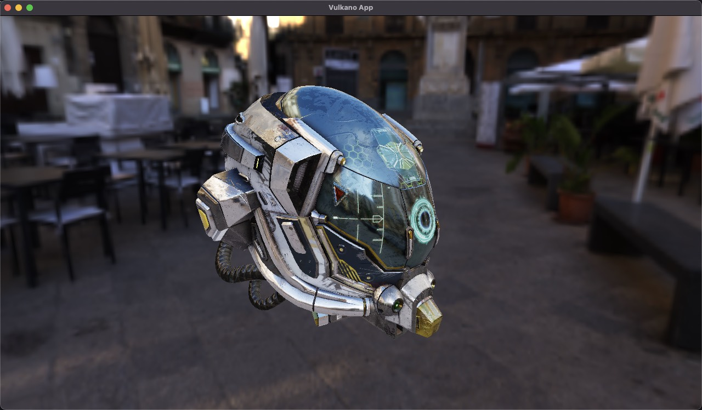

# mo_renderer

A really simple and naive renderer based on the Vulkano crate. Developed for study purpose only. Works on Windows and MacOS.

WASD for moving, hold right mouse button to look around



## Run

```bash
cargo run --example pbr_ibl
```

## Features

+ GLTF loading
+ IBL textures processing
+ Defer rendering
+ PCF shadow mapping
+ SSAO
+ Camera movement
+ PBR metallic-roughness material
+ IBL

## Main third-party crates
+ [vulkano](https://crates.io/crates/vulkano) for Vulkan API
+ [bevy_ecs](https://crates.io/crates/bevy_ecs) for ECS scene management
+ [image](https://crates.io/crates/image) for image processing
+ [gltf](https://crates.io/crates/gltf) for gltf loading
+ [tracing](https://crates.io/crates/tracing) for logging
+ [winit](https://crates.io/crates/winit) for window management

and many other great crates made by the Rust community.
